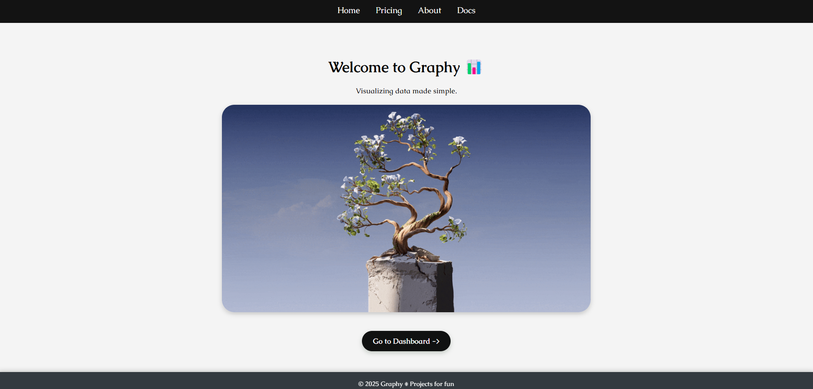
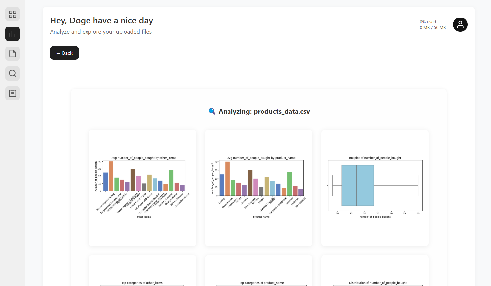
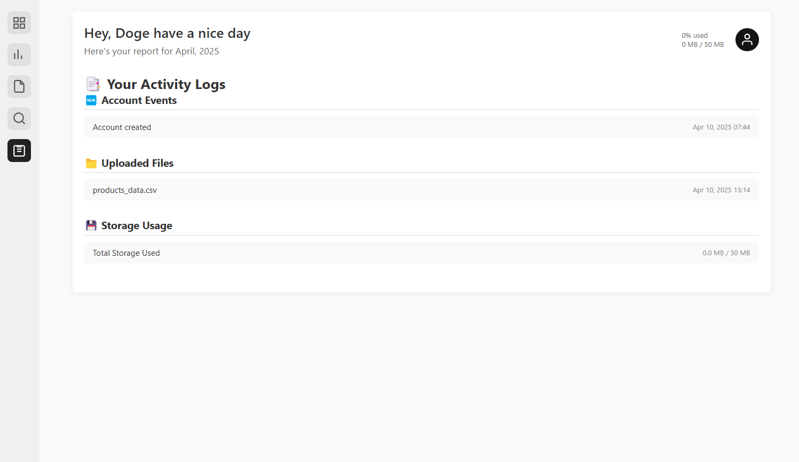
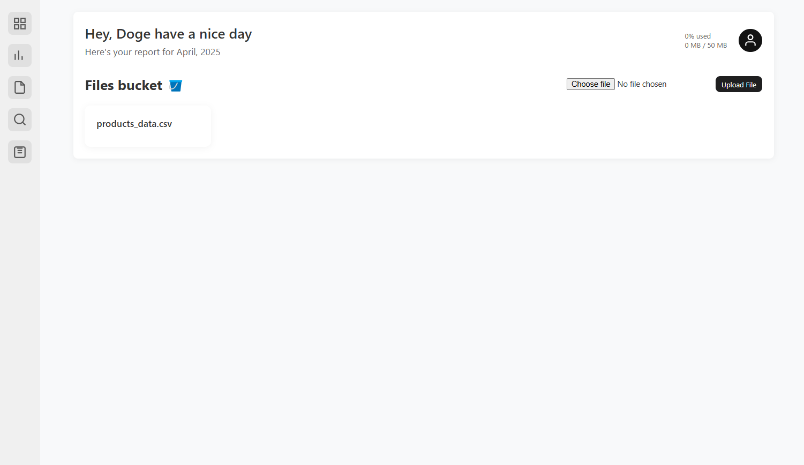
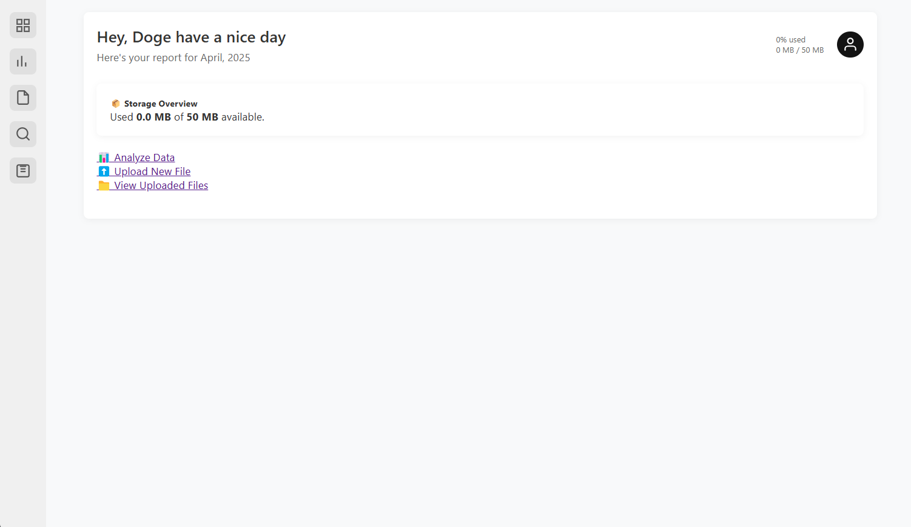

# 📊 Graphy

**Graphy** is a lightweight web application that turns your **CSV** or **Excel** files into beautiful and interactive **visualizations**. Whether you're analyzing sales data or plotting trends from your spreadsheets, Graphy makes it simple and intuitive.

---

## ✨ Features

- 📁 Upload CSV or Excel files
- 📊 Generate real-time, interactive graphs
- 🧠 Automatically detects and plots columns
- 🗂 View analytics history
- 💾 Monitor your file storage usage
- 🔐 Secure dashboard & user authentication

---

## 🖼️ Screenshots
<div align="center">

</div>
<div align="center">
  
  <br>
  
  
</div>

---

## 🛠️ Built With

- **Backend:**  
[](https://www.python.org/)  
[](https://www.djangoproject.com/)
- **Frontend:** HTML, CSS, JavaScript
- **Database:** SQLite (default, can be swapped)
- **Authentication:** Django's built-in user system

---

## 🚀 Getting Started

### Prerequisites

- Python 3.8+
- pip (Python package installer)

### Installation

```bash
# Clone the repository
git clone https://github.com/your-username/graphy.git
cd graphy

# Run migrations
python manage.py migrate

# Start the server
python manage.py runserver
